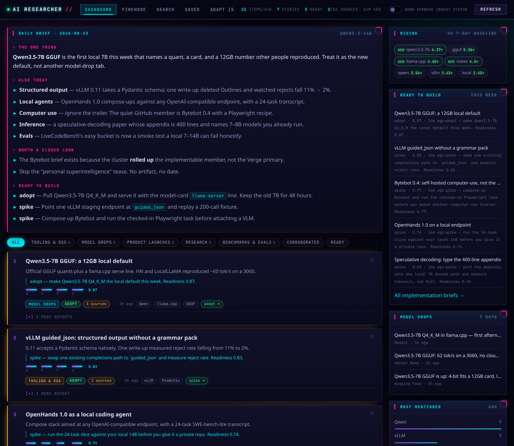
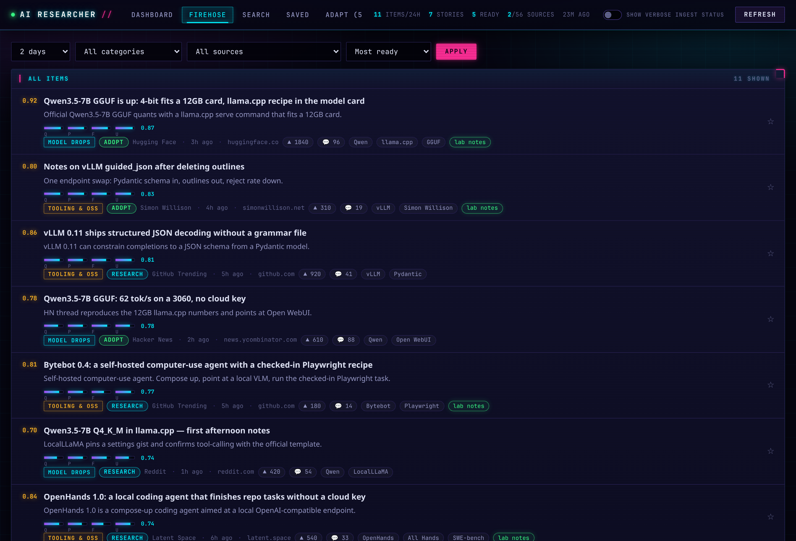
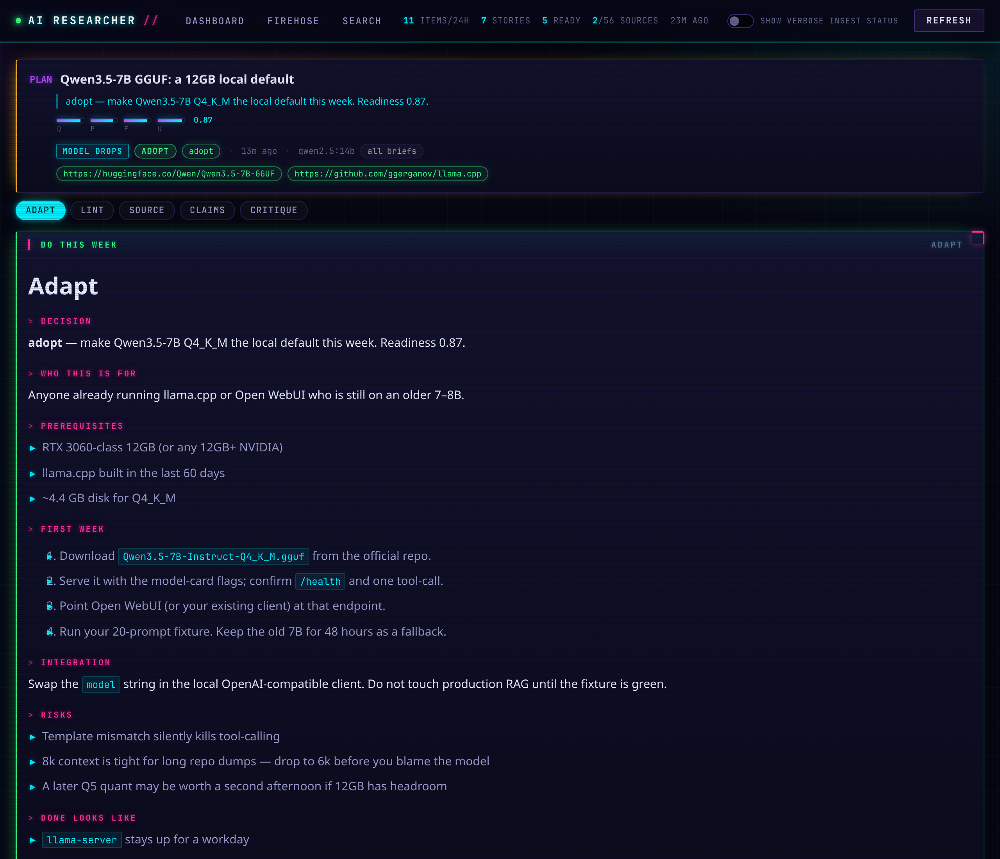
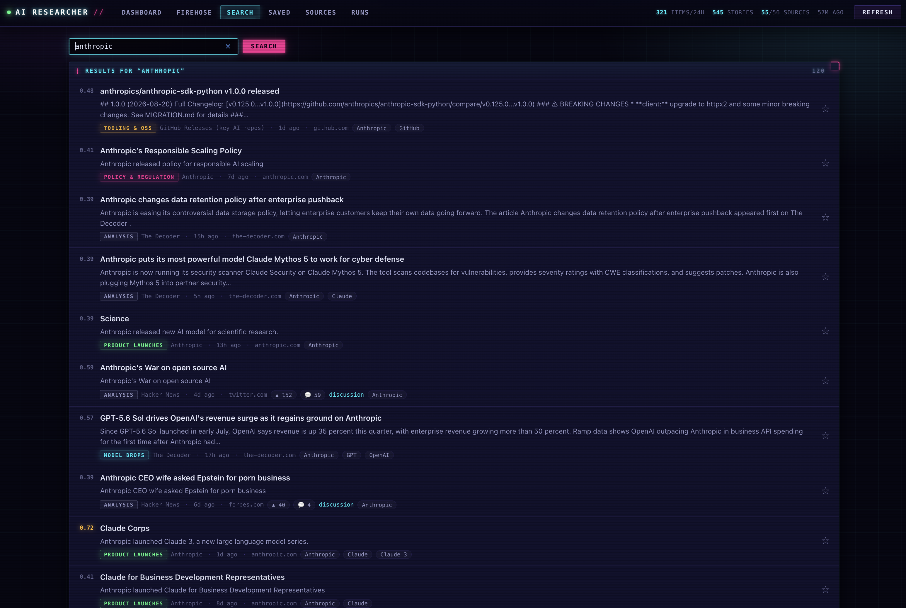
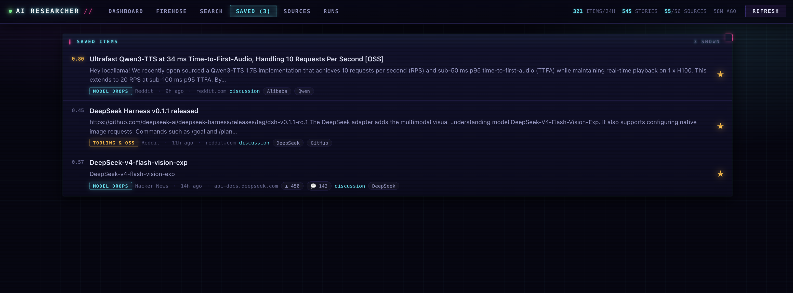
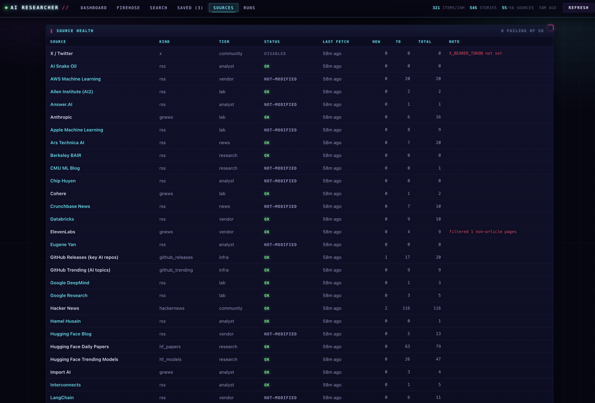
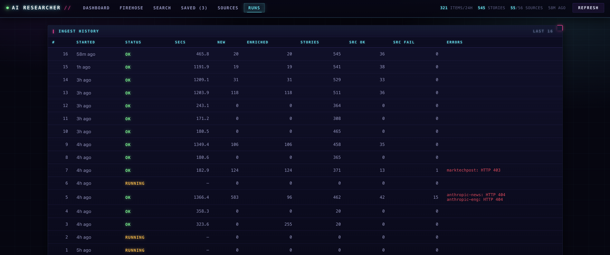

# AI Researcher

[](https://github.com/l34n/AI-Researcher/actions/workflows/ci.yml)
[](LICENSE)
[](https://www.python.org/downloads/)

A single pane of glass for AI: research, model drops, product launches,
acquisitions, tooling, and policy — collected from ~60 sources, clustered into
stories, ranked, and summarised by a local model. Runs entirely on your machine
and is reachable from anywhere on your LAN.

No API keys are required. Local Ollama is the default. Optional Gemini and
OpenRouter keys, when set, take the chat load; embeddings stay local. Every
optional piece degrades to a working fallback.









## Quick start

```bash
uv venv && uv pip install -e ".[dev]"
cp .env.example .env          # every default works; edit if you like
ai-researcher run             # first ingest — takes a while, see below
ai-researcher serve           # http://localhost:8899
```

Then install it as a background service:

```bash
./scripts/install-systemd.sh
```

That runs the dashboard continuously and ingests once an hour.

## Docker

One container serves the dashboard. Ingest can run in-process (default, every
60 minutes) or in a sibling worker that shares the `/data` volume. SQLite lives
in that volume, so rebuilds keep your history.

```bash
cp .env.example .env          # optional: GitHub token, Gemini/OpenRouter keys
docker compose up -d --build
```

Then open http://localhost:8899

```bash
docker compose logs -f ai-researcher
docker compose exec ai-researcher ai-researcher doctor
docker compose exec ai-researcher ai-researcher run     # ingest now, don't wait
docker compose exec ai-researcher ai-researcher backup
```

**Ollama.** The default `OLLAMA_HOST` is `http://host.docker.internal:11434`,
so a Compose stack on Linux/macOS/Windows talks to Ollama on the host. Auto-pick
prefers `gemma3:4b` and will not load a 30B tag just because it is installed.
To run Ollama in Compose as well:

```bash
OLLAMA_HOST=http://ollama:11434 docker compose --profile ollama up -d --build
```

**Split dashboard and worker** (avoids colliding a manual `run` with the
in-process timer):

```bash
AIR_AUTO_REFRESH_MIN=0 docker compose --profile worker up -d --build
```

**No GPU / cloud-only.** Set `GEMINI_API_KEY` or `OPENROUTER_API_KEY` in `.env`
and skip Ollama. Clustering falls back to hashed TF-IDF; the dashboard still
works.

`AIR_AUTO_REFRESH_MIN` defaults to 60 in Compose (systemd users leave it at 0
so the timer is the only scheduler). Set `AIR_ACCESS_TOKEN` if the port will
be reachable beyond a trusted LAN. `/healthz` is liveness, `/readyz` checks
the database, `/health` reports source and model status. The image is a
regular (non-editable) install; bind-mount `/app/config/sources.yaml` to
override the catalog.

## How it works

```
 sources.yaml ──▶ connectors ──▶ items ──▶ heuristics ──▶ embeddings
                  (9 kinds)       (sqlite)   (all items)    (nomic-embed)
                                                 │              │
                                                 ▼              ▼
                                            model pass ──▶ clustering ──▶ stories
                                            (top N only)   (cosine +     (ranked)
                                                            entity guard)      │
                                                                               ▼
                                              judgment ──▶ readiness gate ──▶ daily brief
                                         (quality / practicality /              │
                                          feasibility / usefulness)              │
                                                                               ▼
                                                              Karpathy wiki (top N)
                                                         ingest → claims → critique
                                                              → adapt → lint
```

**Ingest.** Ten connector kinds — RSS/Atom, Reddit, Hacker News, arXiv, HF
daily papers, HF trending models, GitHub releases, GitHub new-and-hot repos,
Google News (for vendors that publish no feed), and X. Each source's health is
tracked; a broken feed is skipped, never fatal.

**Deduplication.** URLs are canonicalised (tracking params stripped, AMP
suffixes removed, host normalised) so the same story arriving from six places
collapses to one. Identical text collapses too, even when retitled.

**Clustering.** Items are grouped by exact URL/text identity, then by cosine
similarity over embeddings (TF-IDF if no embedding model is installed). A
high-similarity pair naming *disjoint* organisations is blocked from merging —
two labs shipping the same kind of thing on the same day is two stories.

**Ranking.** Engagement is normalised per source, because 400 points on Hacker
News and 400 GitHub stars are not the same quantity. The dominant signal is
corroboration: one outlet is a claim, five independent outlets is a story.

**Enrichment** runs in two passes, because local inference is the scarcest
resource here:

1. Rules classify, tag, and score **every** item instantly. The dashboard is
   never blank and never waits on a queue.
2. The model rewrites only the **top-priority** items — the ones that will
   actually appear on the page — bounded by a count *and* a wall-clock budget.

Set `AIR_ENRICH_BUDGET` / `AIR_ENRICH_TIME_BUDGET` to match your hardware.
Deep research is bounded separately by `AIR_RESEARCH_BUDGET` /
`AIR_RESEARCH_TIME_BUDGET` / `AIR_RESEARCH_THRESHOLD`.

## Commands

| Command | What it does |
|---|---|
| `ai-researcher run` | Full cycle: fetch → enrich → cluster → judge → research → brief |
| `ai-researcher run --no-ingest` | Re-analyse what's stored, no fetching |
| `ai-researcher run --source simonw` | Limit to one source (repeatable) |
| `ai-researcher serve` | Web dashboard |
| `ai-researcher worker` | Interval ingest loop (Compose `--profile worker`) |
| `ai-researcher doctor` | Diagnose everything that silently degrades |
| `ai-researcher sources` | Per-source health table |
| `ai-researcher brief` | Print / regenerate today's brief |
| `ai-researcher research` | Re-judge and write deep-research briefs |
| `ai-researcher recluster` | Rebuild stories and topic history |
| `ai-researcher eval` | Offline quality corpus (no network, no GPU) |
| `ai-researcher compare --models a b` | Score two models against the corpus |
| `ai-researcher backup` / `restore` | SQLite backup API + integrity check |
| `ai-researcher stats` | Counters as JSON |

**`doctor` first** whenever something looks wrong — it reports the model in use,
whether embeddings are available, which credentials are missing, and where
content is stuck.

Dashboard shortcuts: `d` dashboard · `f` firehose · `s` search · `b` saved ·
`a` adapt · `h` sources · `r` runs · `/` focus search.

## Quality gate and Karpathy research

Attention (corroboration, engagement, recency) is the wrong axis for "should I
try this". After clustering, every item is scored on four practitioner
questions — **quality**, **practicality**, **feasibility**, **usefulness** —
first by rules, then by the model for the highest-readiness slice.

The composite `readiness` gates a five-turn wiki, following Karpathy's
raw-sources / wiki / schema pattern:

1. **Ingest** — immutable facts, artifacts, claims as stated
2. **Claims** — demonstrated vs asserted, missing evidence
3. **Critique** — the four scores in prose, plus contradictions
4. **Adapt** — who it's for, prerequisites, first-week experiment, risks, done-looks-like
5. **Lint** — contradictions, orphans, unknowns; the last word on the verdict

Only stories at or above `AIR_RESEARCH_THRESHOLD` (default 0.62) with a
`research` or `adopt` verdict spend a slot. The budget is small on purpose:
five model calls per story. With no model the same pages are filed as a
structured digest so the Adapt tab is never blank.

Open `/adapt` (or press `a`) for the week plans. The dashboard **Ready**
chip, the firehose **Most ready** sort, and the daily brief's
**Ready to build** section all read the same gate. A story that already
has a brief links there as **week plan**.

## Benchmark results

**Executive summary (2026-09-04).** The daily brief, the readiness judge and the
research wiki were benchmarked across 13 models: 5 paid OpenRouter, 5 free
OpenRouter and 3 local Ollama tags on a shared 24 GB GPU. On the original
prompt only `google/gemini-2.5-flash` produced usable output; every local
model scored in the 30s and fell back to the templated brief in production.
The gap was not model intelligence. Small models copy the prompt template
(writing a `## Ready to build` section on days with nothing gated, leaving
sections empty when asked for six bullets from one story) and say "watch"
while scoring "research". Rendering the prompt from the data, letting the
blended judge scores decide the verdict, one retry with the validator's
findings, and repairing marker-less bullets instead of rejecting the brief
moved nine of ten models into the Pass band. **For a local-only deployment,
`gemma3:27b` (brief) with `llama3.1:8b` (enrich/judge) is now a production
configuration; for cloud, `deepseek/deepseek-chat` matches gemini on every
backtest metric at a fifth of the price.** Details:
[docs/benchmarking.md](docs/benchmarking.md),
[docs/benchmark-results.md](docs/benchmark-results.md),
[docs/backtest-results.md](docs/backtest-results.md).

Corpus v1.0.0 (21 cases; 3 are hostile fixtures every model fails by design,
so 18/21 is the ceiling), prompt `brief-v5`, harness `validate-v2`, rubric
v1.1, single attempt per case. Backtest: 5 historical dates, up to 8 stories
each, production prompt. Whole sweep cost $0.03 in OpenRouter credit.

| Rank | Model | Tier | Composite | Band | Format | Factuality | Judge verdict agreement | Cases valid | Backtest valid days | Backtest factuality | Wall (s) | Cost |
|---:|---|---|---:|---|---:|---:|---:|---:|---:|---:|---:|---:|
| 1 | `nvidia/nemotron-3-super-120b-a12b:free` | free | 71.6 | Pass | 0.86 | 0.79 | 1.00 | 18/21 | 5/5 | 1.00 | 102 | free |
| 2 | `upstage/solar-pro4` | paid | 70.8 | Pass | 0.86 | 0.79 | 1.00 | 18/21 | 5/5 | 1.00 | 143 | $0.0024 |
| 3 | `nvidia/nemotron-3.5-lightning:free` | free | 69.6 | Pass | 0.81 | 0.77 | 1.00 | 17/21 | 4/5 | 0.93 | 235 | free |
| 4 | `qwen3:32b` | local | 69.5 | Pass | 0.76 | 0.75 | 1.00 | 16/21 | 3/5 | 0.87 | 278 | free |
| 5 | `deepseek/deepseek-chat` | paid | 68.9 | Pass | 0.86 | 0.79 | 1.00 | 18/21 | 5/5 | 1.00 | 250 | $0.0035 |
| 6 | `qwen/qwen3.7-flash` | paid | 67.7 | Pass | 0.86 | 0.75 | 1.00 | 18/21 | 4/5 | 0.93 | 98 | $0.0025 |
| 7 | `gemma3:27b` | local | 66.7 | Pass | 0.86 | 0.79 | 0.67 | 18/21 | 5/5 | 0.96 | 283 | free |
| 8 | `google/gemini-2.5-flash` | paid | 65.2 | Pass | 0.86 | 0.78 | 1.00 | 18/21 | 5/5 | 0.98 | 54 | $0.0172 |
| 9 | `openai/gpt-4.1-nano` | paid | 64.8 | Marginal | 0.86 | 0.73 | 0.67 | 18/21 | 4/5 | 0.93 | 91 | $0.0037 |
| 10 | `llama3.1:8b` | local | 61.3 | Marginal | 0.86 | 0.77 | 1.00 | 18/21 | 5/5 | 1.00 | 86 | free |

Three free-tier models (`minimax/minimax-m2.7:free`, `google/gemma-4-31b-it:free`,
`z-ai/glm-5.2:free`) rate-limited (HTTP 429) on most calls and are reported
as INVALID rather than ranked; the free tier is not viable for a pipeline
that makes ~250 model calls a day. Cost is the whole 26-call sweep per model.
Wall time is not comparable across backends (OpenRouter includes network
hops; Ollama runs on a shared LAN GPU). Composites drift a few points between
runs from sampling; compare the validity counts across sweeps, not the
composite.

### Replicating the research

```bash
git clone https://github.com/mspicer/AI-Researcher-l34n && cd AI-Researcher-l34n
uv venv && uv pip install -e ".[dev]"
python -m pytest                              # offline, no GPU or keys needed

export OPENROUTER_API_KEY=sk-or-...           # https://openrouter.ai/keys
export OLLAMA_HOST=http://<your-ollama>:11434 # local tier; pull the tags in scripts/benchmark_matrix.yaml
dates=2026-08-22,2026-08-26,2026-08-30,2026-09-01,2026-09-03   # or --dates auto

# 1. Benchmark: 21-case corpus, full-fidelity (brief + judge + adapt turns), one model at a time or per tier
python scripts/benchmark_models.py --profile paid  --out data/benchmark-results/paid
python scripts/benchmark_models.py --profile free  --out data/benchmark-results/free
for m in ollama-llama31-8b ollama-gemma3-27b ollama-qwen3-32b; do
  python scripts/benchmark_models.py --model $m --out data/benchmark-results/local
done

# 2. Backtest: the production brief prompt over historical days from your own data/airesearch.db
for tier in paid free local; do
  python scripts/backtest_models.py --profile $tier --dates $dates --out data/backtest-results/$tier
done

# 3. Reports
python scripts/benchmark_report.py --in data/benchmark-results/paid --in data/benchmark-results/free \
  --in data/benchmark-results/local --out docs/benchmark-results.md
python scripts/backtest_report.py --out docs/backtest-results.md

# Re-apply the current rubric to existing result files without any model calls
python scripts/benchmark_models.py --rescore --out data/benchmark-results/paid
```

Add or remove models by editing `scripts/benchmark_matrix.yaml` (no code
change). Before a local run, confirm `curl $OLLAMA_HOST/api/ps` reports
`size_vram == size` for the model, otherwise Ollama is spilling to CPU and
the speed score is meaningless. Reasoning models need `reasoning: false`
(the default) or they spend the whole token budget thinking and return
empty content. The sweeps write under `data/benchmark-results/.runtime/` and
never charge the live service's daily model budget.

## API access

**Nothing is required.** Every core source is public and unauthenticated.

| | Status |
|---|---|
| RSS feeds, arXiv, HF papers/models, Hacker News | No key, no limits worth worrying about |
| **GitHub** | Works unauthenticated at 60 req/hr. The connectors make ~30 calls/run, so it's tight. A **classic token with no scopes checked** raises it to 5,000/hr — recommended. |
| **Reddit** | See below. |
| **X / Twitter** | Needs a paid API tier (~$200/mo). The connector stays dormant without `X_BEARER_TOKEN`; everything else is unaffected. |

### Reddit is RSS-only, on purpose

Reddit ended self-serve API key creation with its Responsible Builder Policy.
Every JSON endpoint — `www`, `old`, and `oauth` — returns **403** to an
unauthenticated client, and new script apps can no longer be registered.

The connector therefore uses the public per-subreddit Atom feeds, which still
work. Those are throttled to roughly **one request per minute per IP**, with a
multi-minute penalty box after any burst. So it **rotates**: each run fetches
`per_run` subreddits (default 4) spaced 75s apart, resuming where the last run
stopped. At one run per hour the whole list cycles every 3–4 hours — plenty for
a daily dashboard.

Consequence: Atom carries no score or comment count. Those items are flagged
`no_score`, and the ranker treats that as *unknown* rather than as zero interest,
so they are neither buried nor artificially boosted.

If you ever obtain approved credentials, set `REDDIT_CLIENT_ID` /
`REDDIT_CLIENT_SECRET` and the connector switches to the faster authenticated
path automatically.

## Local model notes

Enrichment and the brief use the workhorse chat backend (Ollama by default,
Gemini Flash or cheap OpenRouter when a key is set). Both degrade gracefully:
no model means heuristic classification and a templated brief, and the
dashboard still works.

Two things dominate throughput on a small GPU:

- **The model must fit entirely in VRAM.** A 7B Q4 needs ~2.9 GiB of weights
  plus ~1.7 GiB of KV cache. On a 6 GiB card Ollama spills a few layers to CPU
  and throughput collapses — measured here at **2.3 tok/s** for a 7B versus
  **7.3 tok/s** for `qwen3:4b`, a 3× difference from model choice alone.
- **Reasoning models must have thinking disabled.** `qwen3` in default mode
  spent its entire token budget thinking and returned an empty response. The
  client sends `think: false`; extraction needs no chain of thought.

Recommended pulls:

```bash
ollama pull gemma3:4b           # default chat: fits a 6 GiB card
ollama pull nomic-embed-text    # embeddings: much better clustering, 274 MB
```

Pin them in `.env` (`OLLAMA_CHAT_MODEL`, `OLLAMA_EMBED_MODEL`) rather than
relying on auto-detect, so an unrelated `ollama pull` can't silently change
which model your dashboard uses.

### Optional cloud chat (Gemini, OpenRouter)

Local Ollama stays the default. Set `GEMINI_API_KEY` and/or `OPENROUTER_API_KEY`
to shift chat off the GPU. Embeddings never leave Ollama (or TF-IDF).

Routing is quality-gated so the cheap model does bulk work and the expensive
one only sees content that already looks worth it:

| Band | Used for | Default |
|---|---|---|
| **Workhorse** | Enrichment summaries, judgment below the readiness gate | Gemini 2.5 Flash, else cheap OpenRouter, else Ollama |
| **Premium** | Deep-research wiki, daily brief, judgment at `AIR_PREMIUM_READINESS` (0.62) | OpenRouter Claude Sonnet, else Gemini 2.5 Pro, else the workhorse |

Pin the model ids in `.env`. Generated Markdown is passed through an unslop
filter (no em dashes, chatbot openers, or the usual AI vocabulary) so a flash
model cannot dump filler into the Adapt tab.

`ai-researcher doctor` prints which backend is the workhorse and which is premium.

Check `nvidia-smi` works. If it reports a driver/library version mismatch, the
kernel module and userspace libraries have drifted — usually after a driver
update without a reboot — and the GPU will underperform until you reboot.

## Network access

`AIR_HOST` defaults to `0.0.0.0`, so the dashboard is reachable at
`http://<your-lan-ip>:8899` from any device on your network.

It has **no authentication by default**. On a trusted home LAN that's usually
fine. To require a token, set `AIR_ACCESS_TOKEN` in `.env` and append
`?k=YOUR_TOKEN` once per browser — it's remembered in a cookie afterwards.

Do not port-forward this to the public internet as-is. Put it behind a
reverse proxy with real authentication, or reach it over Tailscale/WireGuard.

## Tuning sources

`config/sources.yaml` is the whole catalog. Each entry carries a `weight`
(trust multiplier: 2.0 for a lab announcing its own model, 0.6 for a
high-volume aggregator) and an optional `category_hint`.

- Add a blog: append an `{key, name, kind: rss, tier, weight, url}` entry.
- Mute something noisy: set `enabled: false`, or drop its `weight`.
- Track a repo: add it to `gh-releases`' `repos` list.

Changes take effect on the next run. A source removed from the file stops being
fetched but keeps its history.

## Operational notes

**Runs are long and that is by design.** A full cycle is typically 15–25 minutes:
Reddit's rate limit forces ~75s between subreddits, and the model pass spends its
budget at roughly 20s per item on this hardware. Nothing is blocked meanwhile —
the dashboard serves from the database throughout, and every stage commits as it
goes, so an interrupted run leaves consistent data, just less current.

**Only one ingest runs at a time.** `data/ingest.lock` is an exclusive file lock;
a second run exits immediately with `status: busy`. This matters more than it
sounds: two runs driving Ollama concurrently were observed corrupting the
embedding index — unrelated items received byte-identical vectors, which silently
merged unrelated stories. If you see `another ingest run is already active`, that
is the guard working, not an error.

**When clustering looks wrong, check embedding coverage first.** Items without a
vector cannot merge and appear as single-source stories, so partial coverage
looks exactly like broken clustering. `ai-researcher run` reports
`embedded: N new (M total)`; M should track your item count.

**Source quality dominates everything downstream.** A `site:` search over a whole
vendor domain pulls in careers pages and API reference stubs, which then cluster
together into convincing-looking fake stories. The Google News sources are
scoped to blog paths where one is indexed, and the connector filters
non-article pages regardless. If a new source starts producing odd clusters,
look at what it is actually ingesting on the Sources tab before touching the
clustering thresholds.

## Data

Everything lives in `data/airesearch.db` (SQLite, WAL). Items older than
`AIR_RETENTION_DAYS` (120) are pruned automatically — except anything you've
starred **or that has a research brief**, which is kept indefinitely.
`ai-researcher backup` copies the database via SQLite's backup API and
integrity-checks the copy; `ai-researcher restore --yes backup.db` replaces
the live file. Do not copy a live WAL database with `cp` while ingest is
running.

## Contributing

Contributions are welcome — particularly new sources, which usually need a few
lines of YAML and no Python. See [CONTRIBUTING.md](CONTRIBUTING.md) for the
setup, the connector contract, and the one rule that matters most here:
measure before you assert. Most of the non-obvious constants in this codebase
exist because a reasonable assumption turned out to be wrong against the live
service.

Running the tests needs neither a GPU, an API key, nor a network connection:

```bash
uv pip install -e ".[dev]"
python -m pytest
```

## Notes and limits

- **Not affiliated with any of the sources it reads.** It fetches public feeds
  and public API endpoints, identifies itself honestly in its User-Agent, and
  paces itself under each service's published limits.
- **Reddit is RSS-only.** Reddit ended self-serve API key creation with its
  Responsible Builder Policy, so the connector rotates through the public
  per-subreddit Atom feeds instead. Nothing to configure; see the module
  docstring in `connectors/reddit.py` for the measurements behind the pacing.
- **X/Twitter is dormant without a paid token.** The connector exists and stays
  disabled unless `X_BEARER_TOKEN` is set.
- **The dashboard has no authentication by default.** `AIR_ACCESS_TOKEN` adds a
  shared-secret check, but this is built to sit on a trusted LAN. Do not expose
  it directly to the internet.

## License

[MIT](LICENSE) © Kevin Howard
